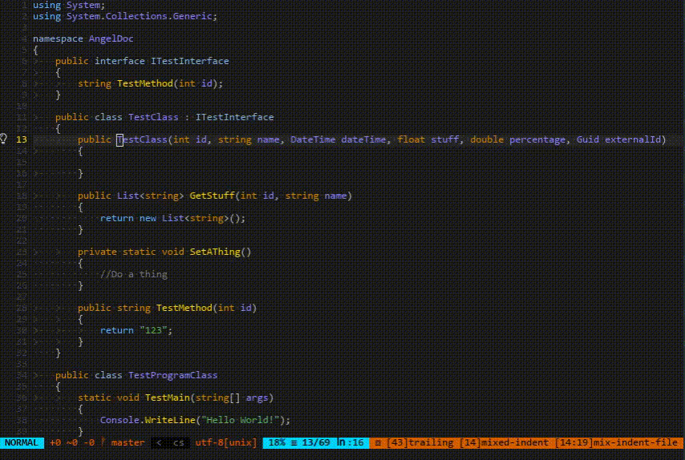

# angeldoc-vim

An open-source replacement for GhostDoc for Vim and NeoVim.




## Setting it up
Put the plugin in your vimrc.

E.g. if you are using Plug:

`Plug 'jpfeiffer16/angeldoc-vim'`

Add a mapping to `AngelDoc#InsertXmlDoc()` in your .vimrc.

Example:
```
nnoremap /// :call AngelDoc#InsertXmlDoc()<CR>
```

Once the plugin is installed, run `:AngelDocInstall` to install the latest release.
The plugin should now work.

## Troubleshooting
If you run into issue running the `AngelDocInstall` command. Try running the below commands from the terminal in the plugin dir for `angeldoc-vim` to manually install the latest release of the AngelDoc tool.

### Windows

`powershell .\manage-releases.ps1`

### Unix

`./manage-releases.ps1`
